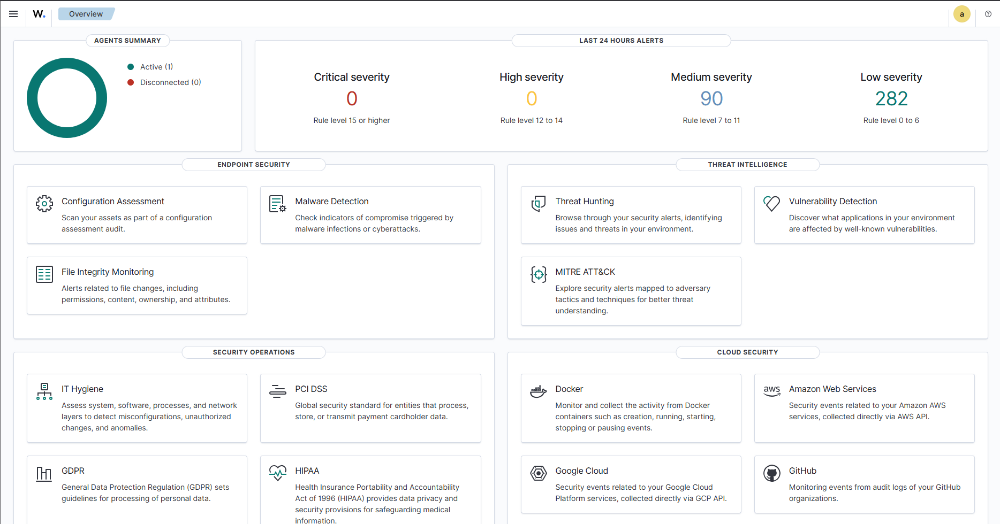
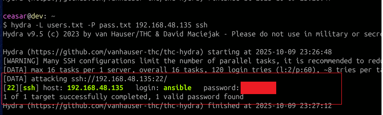
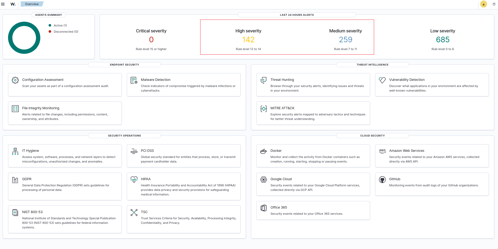

# CI/CD Pipeline

## On PR container images

> [!WARNING]  
> This Deployment uses default credentials for wazuh for testing
> make sure to change your credentials in the ansible vault
> See [Ansible vault example](https://github.com/YESSEO/devops-chall/blob/main/ansible/group_vars/secrets/vault.example.yaml)

* Build Container images
With pushing a wazuh deployment package from the official [wazuh](https://github.com/wazuh/wazuh-docker) repository  to **pre-prod** branch

```bash
$ git add wazuh-docker-4.13.1/                                                                                                                                                                
                                    [12:48:24]                                                                                                                                               
$ git commit -m "DockerFile"                                                                                                                                                                  
                                    [12:48:27]                                                                                                                                               
[pre-prod 9e1d950] DockerFile                                                                                                                                                                 
111 files changed, 8930 insertions(+)                                                                                                                                                        
create mode 100755 wazuh-docker-4.13.1/wazuh-docker-4.13.1_BACKUP/.env                                                                                                                       
create mode 100644 wazuh-docker-4.13.1/wazuh-docker-4.13.1_BACKUP/.github/.goss.yaml                                                                                                         
create mode 100644 wazuh-docker-4.13.1/wazuh-docker-4.13.1_BACKUP/.github/free-disk-space/action.yml                                                                                         
create mode 100755 wazuh-docker-4.13.1/wazuh-docker-4.13.1_BACKUP/.github/multi-node-filebeat-check.sh                                                                                       
...
$ git push                                                        [12:48:46]
Enumerating objects: 154, done.
Counting objects: 100% (154/154), done.
Delta compression using up to 8 threads
Compressing objects: 100% (142/142), done.
Writing objects: 100% (153/153), 90.74 KiB | 2.75 MiB/s, done.
Total 153 (delta 21), reused 0 (delta 0), pack-reused 0
remote: Resolving deltas: 100% (21/21), completed with 1 local object.
To github.com:YESSEO/devops-chall.git
5c6aa83..9e1d950  pre-prod -> pre-prod                                                                               
```

And after submiting a **pull request**


An action execute on our self-hosted runner to build the docker images used by the appication 


Which Build the Docker images at first


if this tasks succuss, Its followed by a **trivy-scan** that exist with status 1 terminating the Pipeline on CRITICAL/HIGH finds, [Reference](https://github.com/YESSEO/devops-chall/blob/main/.github/workflows/pr_wazuh_build.yml#L50)

```yaml
  trivy-scan:
    runs-on: self-hosted
    needs: build-docker-images
    steps:
      - uses: actions/checkout@v4
        with:
          ref: pre-prod
          fetch-depth: 0
          clean: false

      - name: Trivy Scan - Wazuh Indexer
        run: |
          trivy image --scanners vuln wazuh/wazuh-indexer:${{ needs.build-docker-images.outputs.wazuh_version }} \
          --ignorefile "$GITHUB_WORKSPACE"/trivy/.trivyignore \
          --severity CRITICAL,HIGH --exit-code 1 \
          --format json --output "$GITHUB_WORKSPACE"/reports/trivy/trivy-wazuh-indexer.json \
```
From here the action continues deploying the Wazuh application with the built Docker images, and runs a selenium test to make sure all the services are available.


Only after this workflow is succussfull and conditions are met (Trivy-scan) it Continue merging with the `main` branch, firing up the **Pipeline** Deploynig to production servers


## Workflow Explained (prod)

* This action does the follwoing:
  - Ansible dependencies and Inventory file, Ansible vault & secrets, shared variables between playboks
    - Envirment variables
    ```bash
        env:
      ANSIBLE_USER: ${{ vars.ANSIBLE_USER }}
      KEEPALIVED_VIRTUAL_IP: ${{ vars.KEEPALIVED_VIRTUAL_IP }}
      NFS_BASE: ${{ vars.NFS_BASE }}
      NFS_SERVER_HOSTNAME: ${{ vars.NFS_SERVER_HOSTNAME }}
      NFS_SERVER_IP: ${{ vars.NFS_SERVER_IP }}
      SWARM_MANAGER_HOSTNAME: ${{ vars.SWARM_MANAGER_HOSTNAME }}
      SWARM_MANAGER_IP: ${{ vars.SWARM_MANAGER_IP }}
      SWARM_WORKER_HOSTNAME: ${{ vars.SWARM_WORKER_HOSTNAME }}
      SWARM_WORKER_IP: ${{ vars.SWARM_WORKER_IP }}
    ```
    - Inventory from the [inventory template](https://github.com/YESSEO/devops-chall/blob/main/ansible/templates/inventory.example.ini)
    ```ini
      # Docker swarm Manager host
      [managers]
      ${SWARM_MANAGER_HOSTNAME} ansible_host=${SWARM_MANAGER_IP} ansible_user=${ANSIBLE_USER} 
<<<<<<< HEAD

      # Hosts worker
      [workers]
      ${SWARM_WORKER_HOSTNAME} ansible_host=${SWARM_WORKER_IP} ansible_user=${ANSIBLE_USER}

      # NFS server to host wzuh data/config & presistent data
      [data]
      ${NFS_SERVER_HOSTNAME} ansible_host=${NFS_SERVER_IP} ansible_user=${ANSIBLE_USER}
    ```
    - Ansible Secrets & certs, keys
    ```bash
      # Define certificate folder and file
      cert_folder="$GITHUB_WORKSPACE/ansible/group_vars/secrets/certs"
      cert_file="$cert_folder/test.crt"

      # Ensure the folder exists
      if [[ ! -d "$cert_folder" ]]; then
        echo "Directory $cert_folder does not exist. Creating it..."
        mkdir -p "$cert_folder"
      else
        echo "Directory $cert_folder already exists."
      fi

      # Write the certificate from GitHub secret
      base64 --decode > "$cert_file" <<EOF
      ${{ secrets.SSL_CRT }}
      EOF

      chmod 600 "$cert_file"
      echo "Certificate written to $cert_file"

      # Write the key from GitHub secret
      key_file="$cert_folder/test.key"
      base64 --decode > "$key_file" <<EOF
      ${{ secrets.SSL_KEY }}
      EOF
      echo "Key written to $key_file"
      
      # Write the vault from GitHub secret
      secret_vault_file="$GITHUB_WORKSPACE/ansible/group_vars/secrets/vault.yml"
      base64 --decode > "$secret_vault_file" <<EOF
      ${{ secrets.ANSIBLE_VAULT }}
      EOF
    ```
  - Install Docks, Deploy Swarm, and configure **nfs Share** for presistant storage
  ```yaml
    ansible_docker_nfs_vvrp_dependencies:
    runs-on: self-hosted
    environment: prod
    needs: ansible_dependencies
    steps:
      - name: Checkout repository
        uses: actions/checkout@v4
        with:
          clean: false # keep existing files

      - name: Initialize Docker Swarm, configure NFS share, and set up VRRP for HA
        run: |
          ANSIBLE_VAULT_PASSWORD_FILE=<(echo ${{ secrets.ANSIBLE_VAULT_SECRET }}) ansible-playbook -i ansible/inventory/inventory.ini \
            ansible/playbooks/docker_nfs_alived.yaml
  ```
  - Deploys Wazuh muti-node
  ```yaml
    ansible_deploy_stack:
    runs-on: self-hosted
    environment: prod
    needs: ansible_docker_nfs_vvrp_dependencies
    steps:
      - name: Checkout repository
        uses: actions/checkout@v4
        with:
          clean: false

      - name: Deploy Wazuh multi-node stack with replication
        run: |
          ANSIBLE_VAULT_PASSWORD_FILE=<(echo ${{ secrets.ANSIBLE_VAULT_SECRET }}) ansible-playbook -i ansible/inventory/inventory.ini \
            ansible/playbooks/stack_deploy.yaml

  ```
  - Deploys **Nginx reverse proxy**
  ```yaml
    ansible_deploy_nginx:
    runs-on: self-hosted
    environment: prod
    needs: ansible_deploy_stack
    steps:
      - name: Checkout repository
        uses: actions/checkout@v4
        with:
          clean: false

      - name: Configure Nginx reverse proxy (self-signed certificates, no domain - no money -\__(;-;)__/- )
        run: |
          ANSIBLE_VAULT_PASSWORD_FILE=<(echo ${{ secrets.ANSIBLE_VAULT_SECRET }}) ansible-playbook -i ansible/inventory/inventory.ini \
            ansible/playbooks/nginx_reverse_proxy.yaml

  ```
  - Selenium test
  ```yaml
    ansible_selenium_test:
    runs-on: self-hosted
    environment: prod
    needs: ansible_deploy_nginx 
    steps:
      - name: Checkout repository
        uses: actions/checkout@v4
        with:
          clean: false

      - name: Run Selenium tests
        run: |
          ANSIBLE_VAULT_PASSWORD_FILE=<(echo ${{ secrets.ANSIBLE_VAULT_SECRET }}) ansible-playbook -i ansible/inventory/inventory.ini \
            ansible/playbooks/selenium.yaml

  ```
  - Copies Wazuh rules & reload wazuh Master via API call
  ```yaml
    ansible_wazuh_rules:
    runs-on: self-hosted
    environment: prod
    needs: ansible_selenium_test
    steps:
      - name: Checkout repository
        uses: actions/checkout@v4
        with:
          clean: false

      - name: Run Selenium tests
        run: |
          ANSIBLE_VAULT_PASSWORD_FILE=<(echo ${{ secrets.ANSIBLE_VAULT_SECRET }}) ansible-playbook -i ansible/inventory/inventory.ini \
            ansible/playbooks/wazuh_rules.yaml

  ```

> [!WARNING]  
> This Deployment uses default credentials for wazuh for testing
> make sure to change your credentials in the ansible vault
> See [Ansible vault example](https://github.com/YESSEO/devops-chall/blob/main/ansible/group_vars/secrets/vault.example.yaml)

# SOC & Detection rules

## Simulating an attack


=======

      # Hosts worker
      [workers]
      ${SWARM_WORKER_HOSTNAME} ansible_host=${SWARM_WORKER_IP} ansible_user=${ANSIBLE_USER}

      # NFS server to host wzuh data/config & presistent data
      [data]
      ${NFS_SERVER_HOSTNAME} ansible_host=${NFS_SERVER_IP} ansible_user=${ANSIBLE_USER}
    ```
    - Ansible Secrets & certs, keys
    ```bash
      # Define certificate folder and file
      cert_folder="$GITHUB_WORKSPACE/ansible/group_vars/secrets/certs"
      cert_file="$cert_folder/test.crt"

      # Ensure the folder exists
      if [[ ! -d "$cert_folder" ]]; then
        echo "Directory $cert_folder does not exist. Creating it..."
        mkdir -p "$cert_folder"
      else
        echo "Directory $cert_folder already exists."
      fi

      # Write the certificate from GitHub secret
      base64 --decode > "$cert_file" <<EOF
      ${{ secrets.SSL_CRT }}
      EOF

      chmod 600 "$cert_file"
      echo "Certificate written to $cert_file"

      # Write the key from GitHub secret
      key_file="$cert_folder/test.key"
      base64 --decode > "$key_file" <<EOF
      ${{ secrets.SSL_KEY }}
      EOF
      echo "Key written to $key_file"
      
      # Write the vault from GitHub secret
      secret_vault_file="$GITHUB_WORKSPACE/ansible/group_vars/secrets/vault.yml"
      base64 --decode > "$secret_vault_file" <<EOF
      ${{ secrets.ANSIBLE_VAULT }}
      EOF
    ```
  - Install Docks, Deploy Swarm, and configure **nfs Share** for presistant storage
  ```yaml
    ansible_docker_nfs_vvrp_dependencies:
    runs-on: self-hosted
    environment: prod
    needs: ansible_dependencies
    steps:
      - name: Checkout repository
        uses: actions/checkout@v4
        with:
          clean: false # keep existing files

      - name: Initialize Docker Swarm, configure NFS share, and set up VRRP for HA
        run: |
          ANSIBLE_VAULT_PASSWORD_FILE=<(echo ${{ secrets.ANSIBLE_VAULT_SECRET }}) ansible-playbook -i ansible/inventory/inventory.ini \
            ansible/playbooks/docker_nfs_alived.yaml
  ```
  - Deploys Wazuh muti-node
  ```yaml
    ansible_deploy_stack:
    runs-on: self-hosted
    environment: prod
    needs: ansible_docker_nfs_vvrp_dependencies
    steps:
      - name: Checkout repository
        uses: actions/checkout@v4
        with:
          clean: false

      - name: Deploy Wazuh multi-node stack with replication
        run: |
          ANSIBLE_VAULT_PASSWORD_FILE=<(echo ${{ secrets.ANSIBLE_VAULT_SECRET }}) ansible-playbook -i ansible/inventory/inventory.ini \
            ansible/playbooks/stack_deploy.yaml

  ```
  - Deploys **Nginx reverse proxy**
  ```yaml
    ansible_deploy_nginx:
    runs-on: self-hosted
    environment: prod
    needs: ansible_deploy_stack
    steps:
      - name: Checkout repository
        uses: actions/checkout@v4
        with:
          clean: false

      - name: Configure Nginx reverse proxy (self-signed certificates, no domain - no money -\__(;-;)__/- )
        run: |
          ANSIBLE_VAULT_PASSWORD_FILE=<(echo ${{ secrets.ANSIBLE_VAULT_SECRET }}) ansible-playbook -i ansible/inventory/inventory.ini \
            ansible/playbooks/nginx_reverse_proxy.yaml

  ```
  - Selenium test
  ```yaml
    ansible_selenium_test:
    runs-on: self-hosted
    environment: prod
    needs: ansible_deploy_nginx 
    steps:
      - name: Checkout repository
        uses: actions/checkout@v4
        with:
          clean: false

      - name: Run Selenium tests
        run: |
          ANSIBLE_VAULT_PASSWORD_FILE=<(echo ${{ secrets.ANSIBLE_VAULT_SECRET }}) ansible-playbook -i ansible/inventory/inventory.ini \
            ansible/playbooks/selenium.yaml

  ```
  - Copies Wazuh rules & reload wazuh Master via API call
  ```yaml
    ansible_wazuh_rules:
    runs-on: self-hosted
    environment: prod
    needs: ansible_selenium_test
    steps:
      - name: Checkout repository
        uses: actions/checkout@v4
        with:
          clean: false

      - name: Run Selenium tests
        run: |
          ANSIBLE_VAULT_PASSWORD_FILE=<(echo ${{ secrets.ANSIBLE_VAULT_SECRET }}) ansible-playbook -i ansible/inventory/inventory.ini \
            ansible/playbooks/wazuh_rules.yaml

  ```


## Wazuh Dashboard


------------------------

# SOC & Detection rules

## Simulating an attack

* This rules does the following:
- Check if there's 5 faild login atemps in a 120s timeframe comming from the same srcip & user
```xml
<group name="custom-test,">
<rule id="134019" level="10" frequency="5" timeframe="120">
    <decoded_as>sshd</decoded_as>
    <if_matched_sid>5760</if_matched_sid>
     <same_user />
     <same_srcip />
    <description>user $(dstuser) has more than 5 failed login attempts</description>
  </rule>
</group>
```
- If the first rule is triggered and we got a successfull login it raises an alert
```xml
<group name="custom-test2,">
  <rule id="134020" level="14">
    <if_sid>5716</if_sid>
    <if_matched_sid>134019</if_matched_sid>
    <description>Successful connection from IP $(srcip) after failed attempts</description>
  </rule>
</group>

```
- if there's 5 failed login atemps with the same srcip

```xml
<group name="suss-logins,invalid-user">
<rule id="134021" level="10" frequency="5" timeframe="120">
    <decoded_as>sshd</decoded_as>
    <if_matched_sid>5710</if_matched_sid>
     <same_srcip />
    <description>user $(dstuser) Does not exits but has more than 5 failed login attempts</description>
  </rule>
</group>
```
- and its followed by a valid user in the system it raises an alert
```xml
<group name="bruteF-success,">
  <rule id="134022" level="14">
    <if_sid>5760</if_sid>
    <if_matched_sid>134021</if_matched_sid>
    <description>Login attempts with a valid user from $(srcip) after failed invalid user attempts,</description>
  </rule>
</group>
```

### Proof of concept

* To test our rules i decided to run Hydra against my managed host

```
$ hydra -L users.txt -P pass.txt 192.168.48.135 ssh                                                                                                                                [23:26:47]
Hydra v9.5 (c) 2023 by van Hauser/THC & David Maciejak - Please do not use in military or secret service organizations, or for illegal purposes (this is non-binding, these *** ignore laws and ethics anyway).

Hydra (https://github.com/vanhauser-thc/thc-hydra) starting at 2025-10-09 23:26:48
[WARNING] Many SSH configurations limit the number of parallel tasks, it is recommended to reduce the tasks: use -t 4
[DATA] max 16 tasks per 1 server, overall 16 tasks, 120 login tries (l:2/p:60), ~8 tries per task
[DATA] attacking ssh://192.168.48.135:22/
[22][ssh] host: 192.168.48.135   login: ansible   password: <REDACTED>
1 of 1 target successfully completed, 1 valid password found
Hydra (https://github.com/vanhauser-thc/thc-hydra) finished at 2025-10-09 23:27:12
```


* Which successfully generated alerts on the Wazuh dashboard



* Filtering with rule id's


